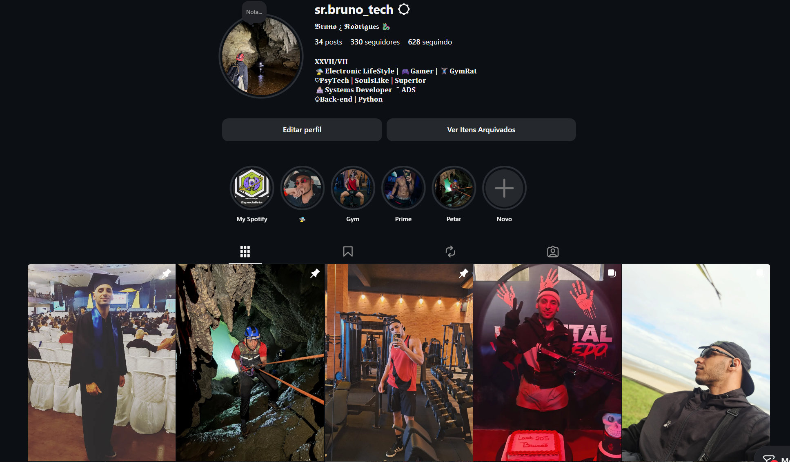
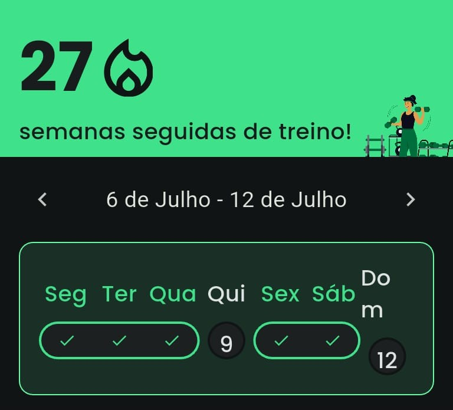

## Olá, eu sou o Bruno! 👋

  

 

Um apaixonado por **Engenharia de Software**, **Arquitetura de Sistemas** e **Cultura DevOps**. Meu foco está em construir ecossistemas de software resilientes, performáticos, altamente testados e comercialmente viáveis.

Atualmente, estou lapidando minhas habilidades focando em boas práticas de Programação Orientada a Objetos (POO), integridade referencial de dados e automação de esteiras de CI/CD.

---

### 🎧 Além do Código (Meus Hobbies & Paixões)

Nem só de linhas de código vive um engenheiro! Quando não estou na trincheira contra o débito técnico, você com certeza vai me encontrar:
* **🕹️ No Mundo dos Games:** Fã de jogos que desafiam a lógica e a estratégia. Os games são meu laboratório de descanso e foco.
* **⚡ Sintonizado na Música Eletrônica:** Amo música no geral, mas a vertente eletrônica é o combustível oficial que dita o ritmo dos meus commits e mantém o foco blindado durante os refactors.
  
---

### 💻 Tech Stack:
   

---
### 📊 GitHub Stats:
 

 

### ✍️ Random Dev Quote

## 🛠️ Stack Tecnológica & Habilidades em Lapidação

* **Linguagens e Paradigmas:** Python 3.13 (Tipagem Estática Avançada, POO Avançada, Encapsulamento de Domínio).
* **Bancos de Dados:** MySQL 8.0 (Modelagem Relacional, Star Schema, Otimização de Queries e Chaves Estrangeiras).
* **DevOps & CI/CD:** GitHub Actions, Automação em Containers Docker, Isolamento de Ambientes Virtuais.
* **Qualidade de Software (QA):** Testes de Integração com Banco Real, Testes Unitários, Mocks Temporários, Cobertura de Código (Coverage.py).
* **Interface & UX/UI:** CustomTkinter/Tkinter Avançado, Padrão Mediator (Controllers), Gerenciamento de Estados de Memória Volátil.

---

## 🚀 Destaque de Engenharia Recente: AVIR AF (v2.0)

Meu projeto mais recente reflete a maturidade técnica que aplico no meu dia a dia. O **AVIR AF** deixou de ser um app desktop comum para se tornar um tanque de guerra financeiro homologado na nuvem.

* **Esteira DevOps na Nuvem (CI/CD):** Pipeline no GitHub Actions que levanta um container **Docker do MySQL 8.0** na nuvem e roda **23 testes automatizados** em menos de 1 minuto a cada commit.
* **Sandbox de Projeção Financeira:** Mecanismo avançado que faz o *merge* em tempo de execução de dados reais do MySQL com inputs voláteis em memória RAM para simular o fluxo de caixa dos próximos 5 meses sem poluir o banco de dados.
* **Inteligência Contábil & Caso Kratos:** Algoritmo de distribuição residual que utiliza `Decimal` (`quantize`) para interceptar dízimas de parcelamento e reinjetar sobras de centavos na última parcela, garantindo precisão contábil.

👉 [Clique aqui para inspecionar a arquitetura completa do AVIR AF](https://github.com/BRUNOSR-DEV/app_financeiro)

---

## 📊 Minhas Estatísticas & Métricas de Desenvolvimento

  
  

  <!-- Streak Stats com o espelho estável -->
  

### 🎮 O Jogo da Cobrinha (Meus Commits / Biscoitos)

  

---

## 🎵 O que estou ouvindo no Spotify?

  

---

## 🤝 Conecte-se Comigo

* **LinkedIn:** [Seu Nome no LinkedIn](https://linkedin.com/in/seu-perfil)
* **Quadro Trello de Projetos:** [Acompanhe minha gestão ágil](https://trello.com/b/PaYLzi3t/appfinanceiro)
* **E-mail:** [seu-email@provedor.com]

### 👽 Além do Código: Identidade Visual & Lifestyle
Esta seção é dedicada a quem deseja conhecer os bastidores da minha rotina, hobbies e o que me move fora do ambiente de desenvolvimento.

  <table border="0" cellpadding="10" cellspacing="0" width="100%">
    <tr style="border: none;">
      <!-- COLUNA 1: PROVAS DE CONSTÂNCIA (INTERATIVO) -->
      <td align="left" valign="top" style="border: none; background: none;" width="50%">
        <h4>📸 Bastidores & Rotina</h4>
        
Clique nos menus abaixo para ver as mídias:

        

          
<b>📷 Perfil do Instagram</b>

           
          
          
        

         
        

          
<b>🏋️‍♂️ Saúde Física e Mental - Métrica Pelo TotalPass</b>

           
          
        

      </td>
      <!-- COLUNA 2: MÍDIA E JOGOS (DINÂMICO) -->
      <td align="center" valign="top" style="border: none; background: none;" width="50%">
        <h4>🎵 No Meu Fone de Ouvido</h4>
          
  
          
        <h4>🎮 No Meu Setup (Xbox)</h4>
        
      </td>
    </tr>
  </table>

